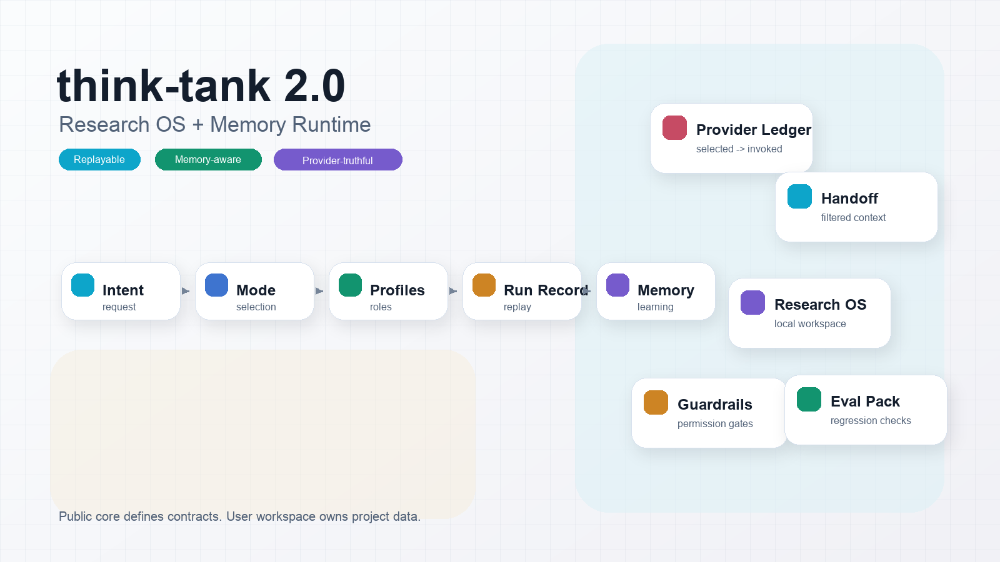

# Changelog

本文件记录 think-tank-skill 仓库和 think-tank 协议的公开演进。

格式参考 Keep a Changelog，版本遵循语义化版本。

## [Unreleased]

### Added

- 增加用户操作路径文档：`first-run-guide.md`、`operator-manual.md`、`cookbook.md` 和 `progression-guide.md`，并在 README 与 docs index 中建立索引。
- 增加 4 份用户操作专属图的 Image2 prompt 资产，覆盖 first run、operator manual、cookbook 和 progression guide。
- 增加 `.think-tank/` 本地工作区协议，用于项目本地 provider policy、memory candidates、runs 和 artifacts。
- 增加 `.think-tank/provider-policy.yaml` 作为唯一支持的项目本地 policy 路径；公开 Skill 源只保留 Codex example policy。
- 增加 project memory capture 协议、recipe、模板、schema、样例报告和检查脚本。
- 增加 local workspace 模板、schema、示例布局和检查脚本。
- Codex provider policy runtime 支持 `providers.auto_select: false`，用于只产出候选记忆、不自动选择外部 persistence provider 的场景。
- Project memory item 增加 `status`、`expires_when`、`review_after` 和 `refresh_trigger`，将记忆过期性纳入正式质量门禁。

### Changed

- README 和 `think-tank/README.md` 改为产品介绍、能力入口和导航，不再承载版本更新记录；版本演进统一收敛到 `CHANGELOG.md`。
- README Hero 图片回退为 v1 Image2 主视觉。
- 移除旧本地 policy 路径兼容思路，避免多个项目本地入口形成多套逻辑。
- 更新 Codex routing 文档，明确触发词和 provider 偏好应由 `.think-tank/provider-policy.yaml` 项目实例配置承载。
- Codex provider policy runtime 改为“默认 policy + `.think-tank` overlay”合并模式，避免本地配置启用后丢失基础 research、council、review 和 strategy 路由。
- 收紧 project memory capture 默认触发词，避免公开 policy 抢占平台或用户自己的通用记忆指令。

## [3.0.0] - 2026-05-21

### Added

- 增加 Skill Experience Layer：`skill-trigger-intelligence`、`skill-invocation-contract`、`progressive-disclosure`、agent compatibility matrix、skill composition guide、skill quality score、v3 examples、self-tests 和 `checks/skill_experience_check.py`。
- 增加 3.0 规划和发布说明：`think-tank/docs/v3.0-roadmap.md` 和 `think-tank/docs/v3.0-release-notes.md`。
- 增加 `think-tank/self-tests/`，用于检查 trigger、anti-trigger、provider boundary、composition 和 memory write 边界。
- 增加 `think-tank/examples/v3/`，提供 skill route decision、invocation contract、progressive disclosure plan、self-test result 和 quality score 样例。

### Changed

- 公开 core 明确不内置触发词；触发词、别名和 provider 偏好由用户自己的 YAML policy 或平台 adapter 管理。
- README 和 `think-tank/README.md` 只保留产品介绍、能力入口和导航，不再承载版本更新记录。
- README Hero 图片回退为 v1 Image2 主视觉，v2 Hero 作为版本视觉记录保留在本 changelog。

### Verified

- `python3 checks/skill_experience_check.py`
- `python3 checks/open_source_release_suite.py`
- `python3 checks/stable_release_check.py`
- `python3 checks/release_privacy_check.py`

## [2.5.0] - 2026-05-21

### Added

- 增加 v2.0 Research OS + Memory Runtime：run record、project memory runtime、provider invocation ledger、handoff protocol、guardrails、research workspace contract 和 eval pack。
- 增加 v2.1 contributor and release polish：`CONTRIBUTING.md`、`SECURITY.md`、`CODE_OF_CONDUCT.md`、`SUPPORT.md`、issue templates 和 PR template。
- 增加 v2.1 capability evidence state machine，细分 installed、discovered、selected、dispatched、invoked、recovered、verified_partial 和 verified。
- 增加 v2.1 memory promotion policy，控制候选记忆从 `.think-tank/memory/` 提升到 AGENTS、项目文档或公开协议的条件。
- 增加 v2.2 Research OS Starter Kit：`think-tank/templates/research-workspace/`。
- 增加 v2.2 Runtime Provenance Gate，强制 think-tank 风格输出声明 runtime、provider 调用、数据来源、结果回收和真实多 agent 状态。
- 增加 v2.3 Eval Pack Starter：`think-tank/evals/`。
- 增加 v2.3 Codex natural-language orchestrator，把用户请求串联到 policy route、minimal dispatch、source recovery、final output 和 run record。
- 增加 v2.4 Provider Test Matrix：`think-tank/docs/provider-test-matrix.md` 和 `think-tank/examples/provider-ledgers/`。
- 增加 v2.5 Docs Site Ready：`think-tank/docs/index.md`、concepts、guides、reference 和 release sections。
- 增加 `think-tank/docs/v2.0-roadmap.md`、`think-tank/docs/v2.0-release-notes.md` 和 `think-tank/docs/v2.1-v2.5-release-notes.md`。

### Verified

- `python3 checks/v2_0_release_check.py`
- `python3 checks/contributor_docs_check.py`
- `python3 checks/research_workspace_template_check.py`
- `python3 checks/eval_pack_check.py`
- `python3 checks/provider_test_matrix_check.py`
- `python3 checks/docs_site_check.py`
- `python3 checks/open_source_release_suite.py`

## [1.1.0] - 2026-05-21

### Added

- 增加 provider integration patterns、workflow pattern examples、Codex installation guide 和对应 release checks。
- 增加 `think-tank/docs/provider-integration-patterns.md`、`think-tank/docs/codex-installation.md`、`think-tank/docs/v1.1-roadmap.md` 和 `think-tank/docs/v1.1-release-notes.md`。
- 增加 `think-tank/examples/provider-patterns/` 和 `think-tank/examples/workflow-patterns/`。
- 增加 README 视觉资产治理规则和 Image2 prompt 目录说明。

### Verified

- `python3 checks/v1_1_release_check.py`
- `python3 checks/provider_integration_patterns_check.py`
- `python3 checks/workflow_patterns_check.py`
- `python3 checks/visual_assets_check.py`

## [0.1.0] - 2026-05-14

### Added

- 建立 `think-tank/` 作为唯一主 Skill 目录。
- 建立协议层：`protocol/`。
- 建立平台适配层：`platforms/claude-code/` 和 `platforms/codex/`。
- 建立场景模式层：`modes/research.md`、`modes/council.md`、`modes/review.md`、`modes/strategy.md`。
- 建立旧资产迁移说明：research think-tank 和 agent-council。
- 建立 Claude Code runtime contract 初稿。
- 完成 Codex 四个核心 mode 的 foundation 验证。
- 增加 Codex 验收文档和验证脚本。
- 增加 capability 降级验证和 Browser optional localhost fixture 验证记录。
- 增加 JSON schema 输入输出样例和样例检查脚本。
- 增加 Codex 主平台运行手册、任务模板和 capability 状态矩阵。
- 验证 Codex 本地 source-acquisition 与 Markdown artifact 闭环。
- 验证 Codex 外部只读 source-acquisition，并将 Browser 外部 DOM 回收标记为 blocked。
- 增加 Codex readiness matrix，明确进入 Claude Code preflight 前的停止点。
- 记录 Claude Code research mode preflight 首轮验证，状态为 `verified_with_format_gap`。
- 记录 Claude Code council mode preflight 首轮验证，状态为 `verified_as_single_agent_council_preflight`。
- 记录 Claude Code capability discovery 验证；skill discovery 为 `verified`，capability 自动调度仍为 `mock/planned`。
- 记录 Claude Code WebFetch 外部只读 source-acquisition 片段验证，状态为 `verified_partial`。
- 记录 Claude Code adapter dispatch 尝试，结论为直接 WebFetch 调用，adapter dispatch 未发生。
- 增加 Claude Code dispatch contract 和目标输出样例。
- 将 Claude Code dispatch contract 接入 `SKILL.md` 执行规则，并增加 dispatch 验证提示词。
- 增加 Claude Code dispatch JSON schema、机器可检查样例和检查脚本。
- 记录 Claude Code dispatch contract 验证，状态为 `verified_partial_with_order_gap`。
- 记录 Claude Code pre-invocation dispatch decision 验证，`capability_auto_mapping` 提升为 `verified_partial_pre_invocation_decision`。
- 增加 v0.1 foundation final 收口文档。
- 增加 Claude Code minimal runtime 约定、schema、成功/失败样例和检查脚本。
- 增加 Codex minimal runtime mirror、参考 runner、成功/失败样例和执行检查脚本。
- 增加 capability 验证队列检查脚本和最终验收计划。
- 记录 Claude Code final low-flow validation，状态为 `verified_partial_with_success_pre_invocation_and_failure_degradation`。
- 增加 v0.2 runtime hardening 契约：runtime、state/result、slot、consensus 和 research hardening。
- 增加 v0.2 四个检查脚本：`runtime_contract_check.py`、`slot_contract_check.py`、`consensus_contract_check.py`、`research_protocol_check.py`。
- 增加 v0.2 平台无关 minimal runtime library：planner、slot resolver、state model、consensus evaluator。
- 增加 v0.2 runtime 实现检查脚本：`runtime_planner_check.py`、`slot_resolver_check.py`、`state_model_check.py`、`consensus_runtime_check.py`。
- 增加 v0.2 adapter integration：平台无关 `runtime-result.schema.json`、Codex runtime pipeline、Claude Code runtime pipeline spec 和 E2E fixture。
- 增加 adapter integration 检查脚本：`runtime_result_schema_check.py`、`codex_runtime_pipeline_check.py`、`claude_runtime_pipeline_spec_check.py`、`runtime_e2e_fixture_check.py`。
- 增加 optional capability 后续验证路线图。
- 完成旧 Claude Code 版 think-tank 全量迁移处置文档，明确每类旧文件的新位置和不原样复制原因。
- 增加 `runtime/safety.py`，迁移旧安全文件名、危险命令、敏感信息清理、prompt injection 和循环检测能力。
- 增加 `templates/`，迁移并重写旧 deep research、expert meeting、task kickoff 模板为跨平台协议模板。
- 增加 Claude Code legacy Team runtime 文档，保留旧 TeamCreate/TeamDelete/checkpoint/heartbeat 经验但不把它们写进 core protocol。
- 增加旧 think-tank 迁移、安全 runtime 和模板检查脚本。
- 完成 v0.3 旧 research agent 全仓迁移处置：7 个 agents、24 个 skills、私有领域 knowledge、logs、memory 和平台私有配置全部归类。
- 增加 `docs/research-agent-full-inventory.md`、`docs/external-skill-interoperability.md`、`docs/v0.3-research-agent-migration.md`。
- 增加 `templates/monitoring-brief.md` 和 `templates/evidence-table.md`，迁移旧 daily briefing、shared results 和证据表输出形态。
- 增加 `checks/research_agent_full_migration_check.py`，确保旧 research agent 资产没有未处置项。
- 完成 v0.4 旧 agent-council 全量迁移处置：references、scripts、history、状态机、安全机制和研究子系统全部归类。
- 增加 `runtime/council.py`，迁移旧 collect/discuss/conclude/complete 状态 helper 和 L1/L2/L3 触发判断。
- 增加 `docs/agent-council-full-inventory.md`、`docs/agent-council-runtime-migration.md`、`docs/agent-council-history-index.md`、`docs/v0.4-agent-council-migration.md`。
- 增加 `templates/council-state.md` 和 v0.4 检查脚本：`agent_council_full_migration_check.py`、`council_runtime_check.py`。
- 增加 v0.5 专业 subagent runtime 契约、runtime helper、role-result schema、profile prompt pack 和平台适配说明。
- 增加 `runtime/subagent.py`，支持生成专业 profile task、profile prompt、role result 聚合和 fallback 标签。
- 增加 `schemas/role-result.schema.json`、`examples/specialist-runtime-fixture.json` 和 v0.5 检查脚本。
- 增加 Codex 本机安装验证文档和 `codex_installed_skill_check.py`。
- 将旧 research agent 工具型 skills 作为 Codex 同级 skills 安装，并增加安装清单和 `codex_external_skills_check.py`。
- 验证 Codex true multi-agent council 只读路径，状态为 `verified_partial`。
- 建立 Codex provider invocation matrix，记录 local static reader、public HTTP static reader 和 playwright localhost readonly DOM snapshot。
- 修复无 capability 的 council/strategy route 误选 provider 的问题。
- 增加 `strategy-planning` YAML route，支持 `制定策略`、`策略规划`、`路线规划` 等通用触发词。
- 增加 Codex runtime verification matrix 文档和检查脚本。
- 增加 MIT License。

### Notes

- 当前版本是主仓基础版本，重点是统一抽象和协议边界。
- 当前只声明 Codex readonly council subagent runtime 为 `verified_partial`；其他平台和 full runtime 仍需独立验证。
- 当前不声明 Browser 外部网页 DOM 回收能力；该路径在当前 Codex 环境标记为 `blocked`。
