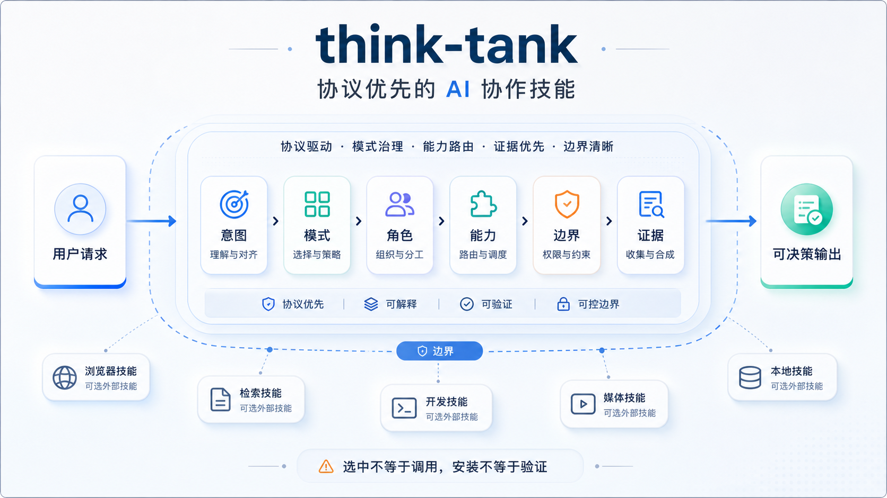
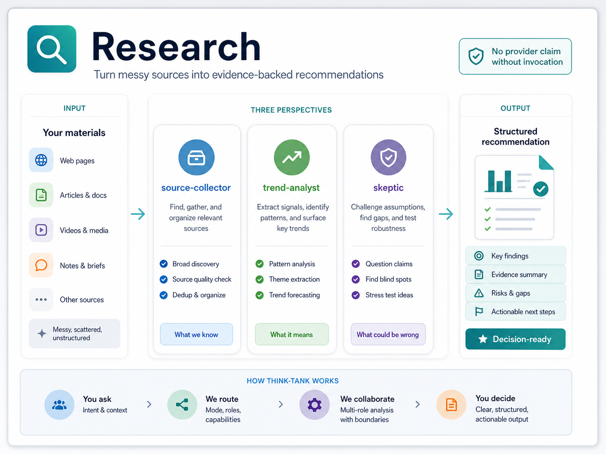
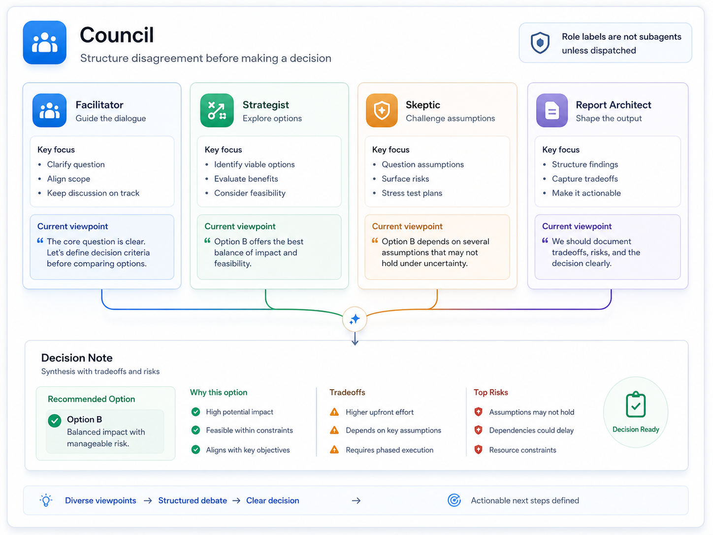
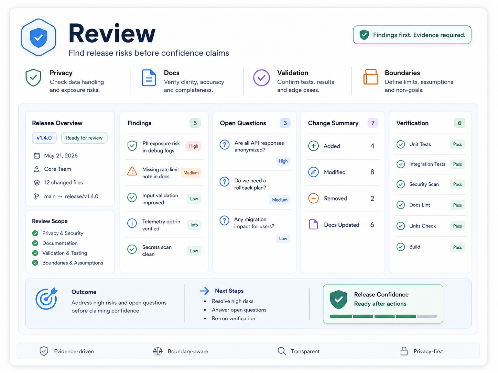
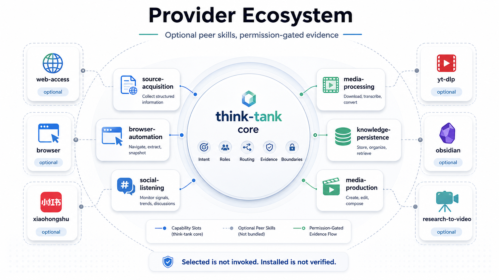
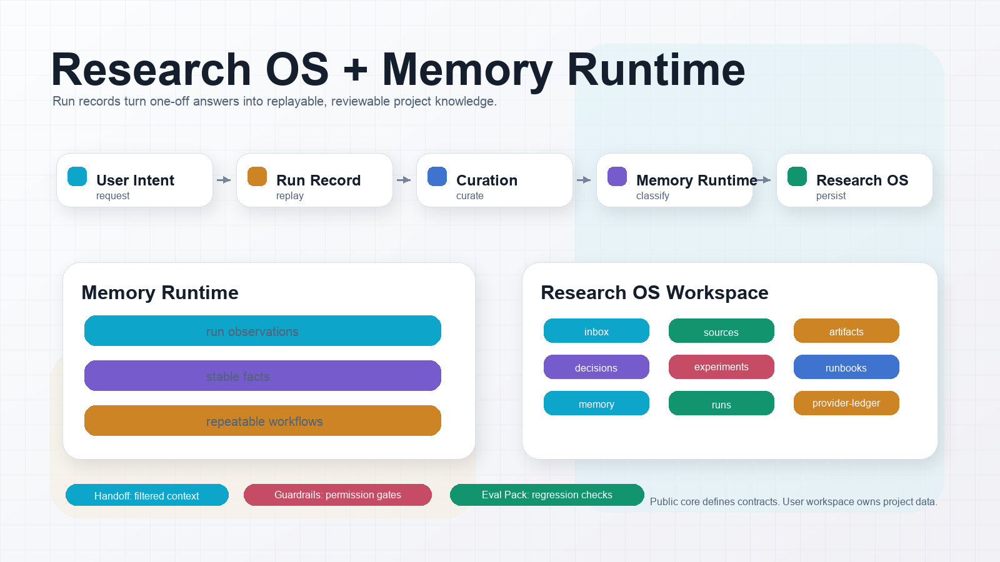
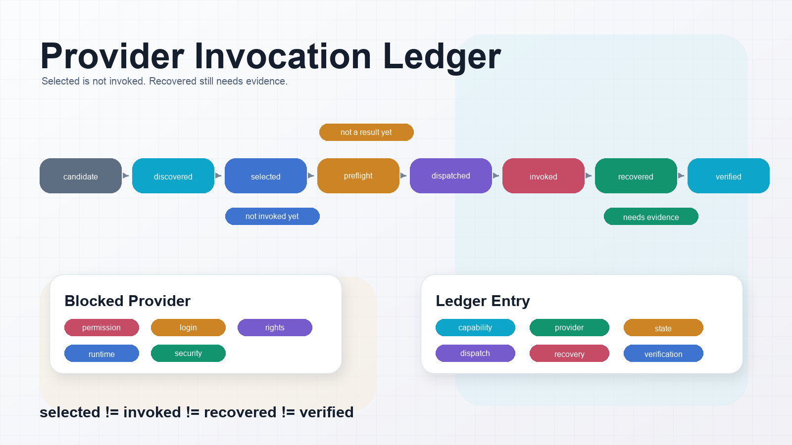

# think-tank-skill

**语言：** [English](README.md) | 中文

**think-tank** 是一个协议优先、跨平台的高阶 AI 协作 Skill，用于研究、审查、讨论决策和策略分析。它当前以 Codex 主路径为默认稳定路径，并用明确的能力边界来说明哪些已经验证、哪些只是可选 provider 生态。



主 Skill 位于 [`think-tank/`](think-tank/)。

## 为什么使用 think-tank？

- 一套协议覆盖 research、review、council、strategy 工作流。
- 明确区分编排层和工具层：
  `think-tank = 任务理解 + 角色组织 + 能力路由 + 证据汇总 + 边界声明`。
- 所有能力都用证据状态描述：`verified`、`verified_partial`、`planned`、`blocked`。
- 提供公开 release gate，检查协议完整性、隐私边界、发布包范围和 stable 姿态。

## 快速开始

1. 阅读 [`think-tank/README.md`](think-tank/README.md) 和 [`think-tank/docs/open-source-quickstart.md`](think-tank/docs/open-source-quickstart.md)。
2. 安装或复制 Skill core：

```text
think-tank/
```

可以把它复制到你的平台 skill 目录，也可以直接 clone 本仓库并引用 `think-tank/`。

3. 先试用公开模板：

```text
think-tank/examples/public/research-request.md
think-tank/examples/public/council-decision.md
think-tank/examples/public/review-acceptance.md
```

4. 运行公开发布门禁：

```bash
python3 checks/open_source_release_suite.py
```

5. 运行 stable gate：

```bash
python3 checks/stable_release_check.py
```

两条命令都通过，说明当前仓库处在可公开发布的稳定路径上。

## 典型场景

| Research | Council | Review |
|---|---|---|
|  |  |  |

## Provider 生态模式

`think-tank` 不内置具体工具。它记录 provider 接入模式，并且只在当前平台暴露 provider、当前任务获得授权时，才把 capability slot 路由到可选 peer skills。



代表性同级技能模式示例：

| 能力槽 | 典型 peer skills | 状态边界 |
|---|---|---|
| source-acquisition | `web-access`, `agent-reach` | 模式已记录，需要证据 |
| browser-automation | `browser`, `playwright-cli` | 只读路径 `verified_partial` |
| social-listening | `xiaohongshu` | 模式已记录，需要登录和授权 |
| media-processing | `yt-dlp`, `openai-whisper` | 模式已记录，需要媒体权限和授权 |
| knowledge-persistence | `obsidian` | 模式已记录，私有写入必须确认 |
| media-production | `research-to-video-production` | verified_partial，限定生产链路 |

更多说明见 [`think-tank/docs/provider-ecosystem-examples.md`](think-tank/docs/provider-ecosystem-examples.md) 和 [`think-tank/docs/provider-integration-patterns.md`](think-tank/docs/provider-integration-patterns.md)。

## Research OS 与记忆运行层

**Research OS + Memory Runtime** 帮助可重复研究任务产出 run record、memory candidate、provider ledger、handoff、guardrail 和 eval fixture。



- **Run Record：** [`think-tank/protocol/run-record.md`](think-tank/protocol/run-record.md)
- **Project Memory Runtime：** [`think-tank/protocol/project-memory-runtime.md`](think-tank/protocol/project-memory-runtime.md)
- **Provider Invocation Ledger：** [`think-tank/protocol/provider-invocation-ledger.md`](think-tank/protocol/provider-invocation-ledger.md)
- **Handoff Protocol：** [`think-tank/protocol/handoff-protocol.md`](think-tank/protocol/handoff-protocol.md)
- **Guardrails：** [`think-tank/protocol/guardrails.md`](think-tank/protocol/guardrails.md)
- **Research OS：** [`think-tank/protocol/research-os.md`](think-tank/protocol/research-os.md)
- **Eval Pack：** [`think-tank/protocol/eval-pack.md`](think-tank/protocol/eval-pack.md)



## 开源可用性

- **贡献与社区治理：** [`CONTRIBUTING.md`](CONTRIBUTING.md)、[`SECURITY.md`](SECURITY.md)、[`CODE_OF_CONDUCT.md`](CODE_OF_CONDUCT.md)、[`SUPPORT.md`](SUPPORT.md)、issue templates 和 PR template。
- **Research OS Starter Kit：** [`think-tank/templates/research-workspace/`](think-tank/templates/research-workspace/)。
- **Eval Pack Starter：** [`think-tank/evals/`](think-tank/evals/)。
- **Provider Test Matrix：** [`think-tank/docs/provider-test-matrix.md`](think-tank/docs/provider-test-matrix.md)。
- **Docs Site：** [`think-tank/docs/index.md`](think-tank/docs/index.md)、concepts、guides、reference 和 release 分区。

## Skill Experience Layer

**Skill Experience Layer** 让 Codex、Claude Code 和其他 agent 更容易判断何时使用 `think-tank`、如何形成 invocation contract、如何渐进加载文档、如何安全组合 optional peer skills，以及如何用 self-test 检查常见边界。

触发词不内置在公开 core 里。触发词、别名和 provider 偏好应放在用户自己的 YAML policy 中；`think-tank` 只提供 intent 类别、路由契约和检查规则。

- **Skill Trigger Intelligence：** [`think-tank/protocol/skill-trigger-intelligence.md`](think-tank/protocol/skill-trigger-intelligence.md)
- **Skill Invocation Contract：** [`think-tank/protocol/skill-invocation-contract.md`](think-tank/protocol/skill-invocation-contract.md)
- **Progressive Disclosure：** [`think-tank/protocol/progressive-disclosure.md`](think-tank/protocol/progressive-disclosure.md)
- **Agent Compatibility Matrix：** [`think-tank/docs/agent-compatibility-matrix.md`](think-tank/docs/agent-compatibility-matrix.md)
- **Skill Composition Guide：** [`think-tank/docs/skill-composition-guide.md`](think-tank/docs/skill-composition-guide.md)
- **Skill Quality Score：** [`think-tank/docs/skill-quality-score.md`](think-tank/docs/skill-quality-score.md)
- **Skill Experience 示例：** [`think-tank/examples/v3/`](think-tank/examples/v3/)
- **Skill Self Tests：** [`think-tank/self-tests/`](think-tank/self-tests/)

版本更新记录统一放在 [`CHANGELOG.md`](CHANGELOG.md)。

## 仓库结构

```text
think-tank-skill/
├── README.md
├── README_CN.md
├── LICENSE
├── .gitignore
├── think-tank/
│   ├── SKILL.md
│   ├── README.md
│   ├── protocol/
│   ├── capabilities/
│   ├── profiles/
│   ├── platforms/
│   ├── modes/
│   ├── templates/
│   ├── runtime/
│   ├── self-tests/
│   ├── docs/
│   └── examples/
```

## Stable 是什么含义？

Stable 表示：

- `think-tank/` 协议面稳定。
- Codex-first 默认路径稳定。
- 公开 release gate 稳定。
- 能力声明基于证据状态。

Stable 不表示：

- 所有 optional provider 默认可用。
- 所有平台 runtime 都已完成。
- 登录、社媒抓取、私有知识库写入是默认能力。
- 安装同级 skill 就等于已经被真实调用和回收结果。

## 证据概览

| 范围 | 状态 | 来源 |
|---|---|---|
| Codex foundation | verified | [`think-tank/docs/codex-readiness-matrix.md`](think-tank/docs/codex-readiness-matrix.md) |
| Provider invocation proofs | 4 public proofs | [`think-tank/examples/stable-release-readiness.yaml`](think-tank/examples/stable-release-readiness.yaml) |
| 外部浏览器只读 | verified_partial | [`think-tank/examples/codex-browser-external-readonly.md`](think-tank/examples/codex-browser-external-readonly.md) |
| subagent runtime | verified_partial | [`think-tank/examples/codex-subagent-lifecycle-validation.md`](think-tank/examples/codex-subagent-lifecycle-validation.md) |
| Claude Code runtime | deferred | [`think-tank/docs/support-matrix.md`](think-tank/docs/support-matrix.md) |

## 推荐阅读

- [`think-tank/README.md`](think-tank/README.md)
- [`think-tank/docs/open-source-quickstart.md`](think-tank/docs/open-source-quickstart.md)
- [`think-tank/docs/support-matrix.md`](think-tank/docs/support-matrix.md)
- [`think-tank/docs/validation-tiers.md`](think-tank/docs/validation-tiers.md)
- [`think-tank/docs/provider-ecosystem-examples.md`](think-tank/docs/provider-ecosystem-examples.md)
- [`think-tank/docs/provider-integration-patterns.md`](think-tank/docs/provider-integration-patterns.md)
- [`think-tank/docs/codex-installation.md`](think-tank/docs/codex-installation.md)
- [`think-tank/docs/index.md`](think-tank/docs/index.md)
- [`think-tank/docs/faq.md`](think-tank/docs/faq.md)
- [`think-tank/docs/troubleshooting.md`](think-tank/docs/troubleshooting.md)
- [`think-tank/docs/provider-test-matrix.md`](think-tank/docs/provider-test-matrix.md)
- [`think-tank/docs/open-source-release.md`](think-tank/docs/open-source-release.md)

## 验证

公开 release gate：

```bash
python3 checks/open_source_release_suite.py
```

stable gate：

```bash
python3 checks/stable_release_check.py
```

## 设计边界

协议层定义 think-tank 是什么。平台 adapter 定义它如何在具体环境运行。mode 定义场景默认策略。

平台特有行为不能反向改写 core protocol。
