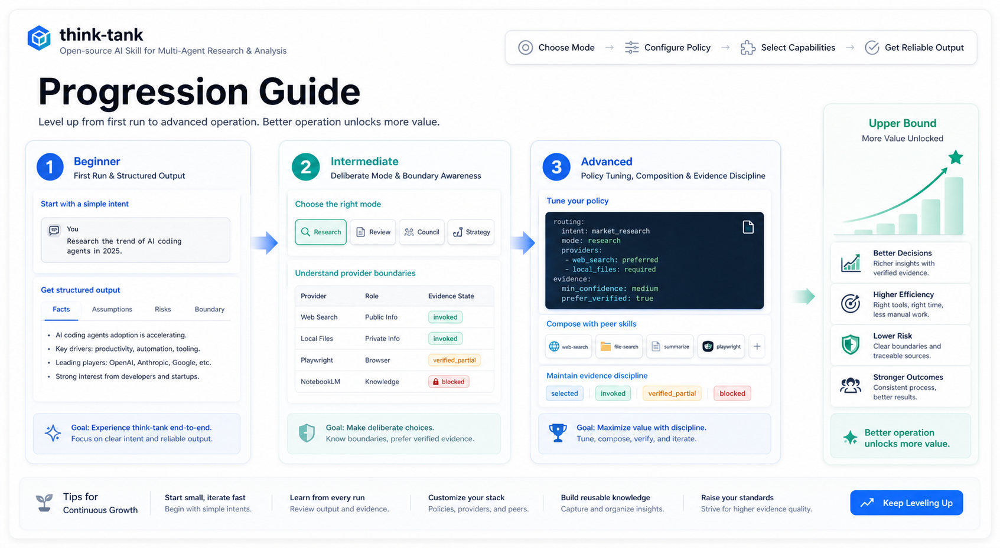

# Progression Guide

This guide explains how users unlock more value from `think-tank` as they
become more deliberate operators.

## Beginner

At this stage, the user can:

- install the public skill core
- run a first review or research prompt
- recognize conclusion, evidence, risks, and boundaries

Recommended focus:

- use local files first
- learn the difference between direct answer and think-tank style output

## Intermediate

At this stage, the user can:

- choose `research`, `review`, `council`, or `strategy` intentionally
- recognize when a capability slot is needed
- understand that route selection is not provider invocation
- read `verified`, `verified_partial`, `planned`, and `blocked` correctly

Recommended focus:

- start using composition patterns
- begin drafting a user-owned YAML policy
- compare multiple task shapes

## Advanced

At this stage, the user can:

- shape tasks so the right mode emerges quickly
- combine `think-tank` with peer skills safely
- manage evidence states and dispatch boundaries precisely
- create reusable team or project operating patterns

Recommended focus:

- tune policy deliberately
- use run records, memory/runtime artifacts, and self-tests
- verify provider claims with discipline

## Upper Bound

The upper bound of `think-tank` is unlocked when the user can frame the task
correctly, choose the right reasoning shape, use capability routing
intentionally, and treat boundaries as part of the result.
